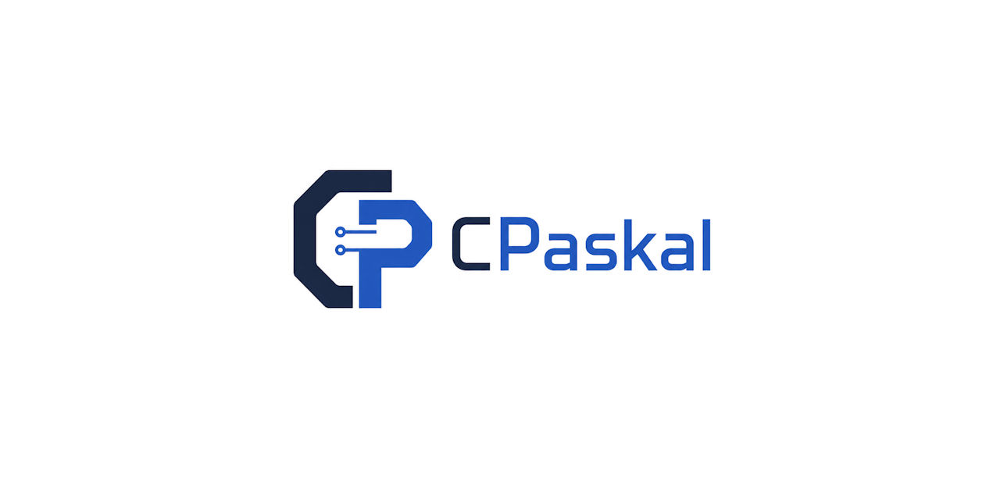
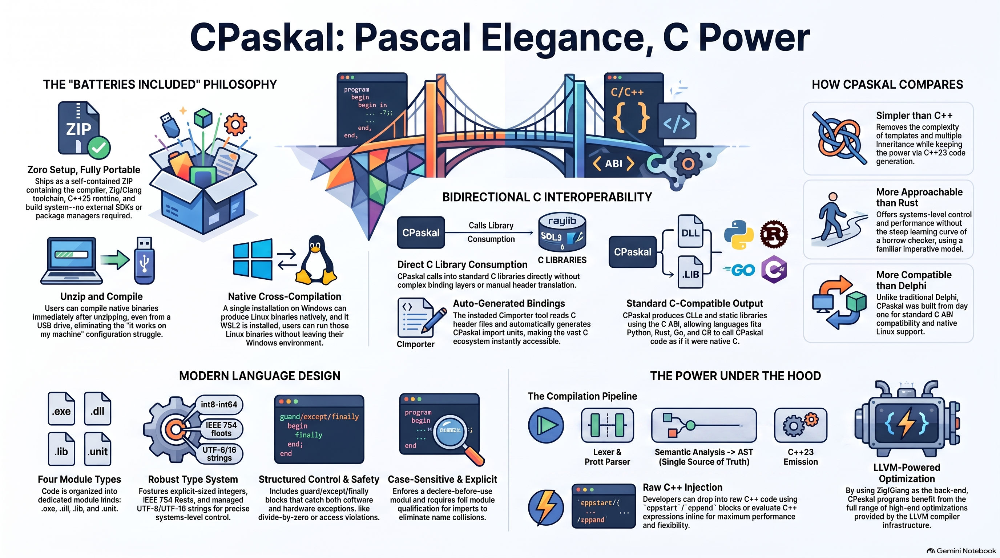

<div align="center">



<h3>Programming Language</h3>

[](https://discord.gg/Wb6z8Wam7p) [](https://www.facebook.com/groups/cpaskal) [](https://bsky.app/profile/tinybiggames.com)

</div>

## What is CPaskal?

CPaskal is a systems programming language that combines Pascal's clarity with complete C ABI interoperability. It compiles `.cpas` source files to C++23, then builds native x86_64 binaries via a bundled Zig/Clang toolchain. Two targets are officially supported: Windows (Win64) and Linux (Linux64).

```cpas
module exe hello;

begin
  println("Hello from CPaskal!");
end.
```

The name is deliberate: "C" for C ABI compatibility, "Paskal" honoring Niklaus Wirth's Pascal. The "k" distinguishes it from the original while acknowledging its heritage.

## Why CPaskal?

CPaskal solves a problem that has existed in the Pascal world for decades: clean C interoperability.

If a library has a C API -- raylib, SDL3, SQLite, zlib, Vulkan -- CPaskal can call it directly. No binding generators, no wrapper layers. And when you compile a CPaskal DLL or static library, the output uses the C ABI. Any language that can call C -- which is virtually all of them -- can call your CPaskal code.

This bidirectional interop is what sets CPaskal apart. It is not just a consumer of the C ecosystem. It is a full participant.

## 🎬 Media

<div align="center">
<br/>



<!-- VIDEO: paste the GitHub user-attachments URL here -->

</div>

## 🔋 Batteries Included

CPaskal ships as a completely self-contained package. The compiler, the Zig/Clang toolchain, the C++23 runtime, the build system -- everything is in the box. There is nothing to install separately. You unzip, you compile, you get native binaries.

The same installation that builds Windows binaries can also produce Linux binaries. If WSL2 is available, you can run them immediately.

## ✨ Key Features

- **Clean Pascal syntax** with `begin..end` blocks, `:=` assignment, strong static typing, and a module system
- **Full C ABI interop** -- consume any C library, produce C-compatible binaries
- **Native binaries** -- real executables, shared libraries, and static libraries via Zig/Clang
- **Four module kinds** -- `exe`, `dll`, `lib`, `unit`
- **Explicit sized types** -- `int8` through `int64`, `uint8` through `uint64`, `float32`, `float64`
- **Records with inheritance**, overlays (unions), packed/aligned records, bit fields
- **Routine overloading** with automatic linkage management
- **Structured exceptions** -- `guard`/`except`/`finally` catches both software and hardware faults
- **Conditional compilation** -- `@ifdef`/`@ifndef`/`@else`/`@endif` with predefined platform symbols
- **C++ escape hatch** -- `cppstart`/`cppend` blocks and `cpp()` inline expressions
- **Managed strings** -- UTF-8 `string` and UTF-16 `wstring`
- **Sets, dynamic arrays, pointers, routine types** -- the full systems programming toolkit
- **Built-in unit testing** -- `test` blocks with assertion intrinsics
- **Format-string output** -- `println("value = {}", x)` with automatic type formatting

## 🚀 Quick Start

Every CPaskal program is a module. The module kind determines the output:

| Declaration | Output |
|---|---|
| `module exe name` | Native executable |
| `module dll name` | Shared library (.dll / .so) |
| `module lib name` | Static library |
| `module unit name` | Importable source module |

A minimal program:

```cpas
module exe hello;

routine add(const a: int32; const b: int32): int32;
begin
  return a + b;
end;

begin
  println("Hello from CPaskal!");
  println("add(2, 3) = {}", add(2, 3));
end.
```

Compile and run:

```bash
cpas hello -r
```

## 📝 The Language

### Types

CPaskal has explicit-width primitive types essential for systems programming and C interop:

| Category | Types |
|---|---|
| Signed integers | `int8`, `int16`, `int32`, `int64` |
| Unsigned integers | `uint8`, `uint16`, `uint32`, `uint64` |
| Floating point | `float32`, `float64` |
| Text | `char`, `wchar`, `string`, `wstring` |
| Other | `boolean`, `pointer`, `pointer to T` |

### Records and Overlays

Records are CPaskal's structured data type. They support single inheritance, packing, alignment, nested overlays (unions), and bit fields:

```cpas
type
  Point = record
    x: int32;
    y: int32;
  end;

  Derived = record(Point)
    z: int32;
  end;

  Tagged = record
    tag: int32;
    overlay
      iVal: int64;
      fVal: float64;
    end;
  end;
```

Record literals use named initialization:

```cpas
var pt: Point = Point(x: 42, y: 99);
```

### Routines

Functions and procedures are unified under `routine`. Parameters are `const` by default:

```cpas
routine distance(a: Point; b: Point): float64;
var dx: float64;
var dy: float64;
begin
  dx := a.x - b.x;
  dy := a.y - b.y;
  return cpp("std::sqrt(dx*dx + dy*dy)");
end;
```

Routines are first-class values via routine types:

```cpas
type BinaryOp = routine(x: int32; y: int32): int32;

var op: BinaryOp = add;
println("result = {}", op(3, 4));
```

### Control Flow

```cpas
if x > 0 then
  println("positive");
end;

while count < 10 do
  count += 1;
end;

for i := 1 to 10 do
  total += i;
end;

match value of
  0: println("zero");
  1..5: println("low");
else
  println("high");
end;
```

### Exception Handling

CPaskal catches both software exceptions and hardware faults (divide-by-zero, access violations):

```cpas
guard
  result := a div b;
except
  println("error: {}", excmsg());
finally
  cleanup();
end;
```

### Module System

All access to imported symbols requires full module qualification:

```cpas
import myutils;

begin
  println("{}", myutils.util_add(3, 4));
end.
```

Symbols are private by default. The `public` keyword exports them:

```cpas
public const VERSION: int32 = 1;
public routine add(const a: int32; const b: int32): int32;
```

## 🔗 C/C++ Interoperability

### External Clause

Bind CPaskal routines to C library functions:

```cpas
routine clink c_abs(const n: int32): int32; external "c" name "abs";
routine clink InitWindow(w: int32; h: int32; title: pointer); external "raylib";
```

### Raw C++ Blocks

Inject C++ directly into the generated output:

```cpas
cppstart header
#include <cmath>
cppend

cppstart source
double my_helper() { return 3.14; }
cppend
```

### Inline C++ Expressions

```cpas
var result: int32 = cpp("my_helper_function()");
```

## ♻️ Module Lifecycle

All module kinds support optional `initialize` and `finalize` blocks:

```cpas
module dll mylib;

public routine clink compute(const x: int32): int32;
begin
  return x * x;
end;

initialize
  println("library loaded");
end;

finalize
  println("library unloading");
end;

end.
```

`exe` modules have a `begin..end.` entry point. `dll`, `lib`, and `unit` modules do not.

## 🧪 Built-in Testing

Test blocks appear after the module's `end.` and run when `@unittestmode` is active:

```cpas
module exe mathlib;

@unittestmode on;

routine add(const a: int32; const b: int32): int32;
begin
  return a + b;
end;

end.

test "add returns correct sum"
begin
  asserteq(5, add(2, 3));
end;
```

## ⚙️ Conditional Compilation

```cpas
@ifdef TARGET_WIN64
  routine clink GetTickCount64(): uint64; external "kernel32" name "GetTickCount64";
@endif

@ifdef TARGET_LINUX64
  routine clink getpid(): int32; external "c" name "getpid";
@endif
```

Predefined symbols include `CPASKAL`, `TARGET_WIN64`, `TARGET_LINUX64`, `CPUX64`, `BUILD_EXE`, `BUILD_DLL`, `BUILD_LIB`, `DEBUG`, and `RELEASE`.

## 📖 Documentation

The full language reference, directive list, BNF grammar, toolchain guide, embedding API and how-to recipes are in a single document:

| Document | Description |
|---|---|
| **[CPaskal](docs/CPaskal.md)** | Complete tour: types, routines, records, objects, choices, sets, arrays, strings, control flow, exceptions, memory, pointers, overlays, variadics, modules, C++ interop, directives, intrinsics and test blocks. Plus the full BNF grammar, the `.mld` meta-language reference (how to hack the compiler), the toolchain (compiler CLI, DAP debugger, LSP), the embedding API, and task-oriented recipes. |

## 📦 Getting CPaskal

### Download the Latest Release

**A release is what you need to use CPaskal.** Cloning the repository is not enough -- the toolchain and the compiled binaries are not in it. A release bundles everything required to go from a `.cpas` file to a native binary: the compiler, the Zig/Clang build backend, the C++ runtime, the standard library, the vendor bindings, and the debug adapter. It is pre-built and ready to run.

**[Download the latest release](https://github.com/tinyBigGAMES/CPaskal/releases/latest)**

Unzip it, add `bin\` to your `PATH`. That is the complete installation.

```
CPaskal/
  bin/
    cpas.exe              <- compiler
    res/
      runtime/            <- Myra C++ runtime
      libs/std/           <- standard library modules
      libs/vendor/        <- vendor bindings (raylib, SDL3)
      tests/              <- test suite (.myra)
      zig/                <- bundled Zig/Clang toolchain
```

## 💻 CLI Reference

```bash
cpas <source> [options]
```

| Flag | Description |
|---|---|
| `-r` | Compile and run |
| `-t <target>` | Set target (`x86_64_windows`, `x86_64_linux`) |
| `-opt <level>` | Optimization (`debug`, `release-safe`, `release-fast`, `release-small`) |
| `-sub <type>` | Subsystem (`console`, `gui`) |

```bash
cpas hello                      # compile
cpas hello -r                   # compile and run
cpas hello -r -t x86_64_linux   # cross-compile for Linux and run (via WSL2)
```

## 🏗️ The Compilation Pipeline

1. **Lexer** -- tokenizes `.cpas` source with dynamically registered keywords
2. **Parser** -- recursive descent + Pratt parser produces a detailed AST
3. **Semantic Analysis** -- enriches the AST with resolved types, symbols, and cross-module references
4. **Code Generation** -- pure AST walker emits C++23
5. **Zig/Clang** -- compiles C++23 to native binary with full LLVM optimization

The compiler is a single executable (`cpas.exe`) that drives the entire pipeline.

## 📋 System Requirements

| | Requirement |
|---|---|
| **Host OS** | Windows 10/11 x64 |
| **Linux auto-run** | WSL2 + Ubuntu |
| **External toolchain** | None. Zig/Clang is bundled. |

## 🔨 Building the Compiler from Source

The compiler is implemented in Delphi (Object Pascal).

### Prerequisites

| | Requirement |
|---|---|
| **Host OS** | Windows x64 |
| **Compiler** | Delphi 12 Athens or higher |
| **Release** | Required. Supplies `bin\res\` (toolchain, runtime). |

### Compile

1. Open the project group in Delphi
2. Build the `CPAS` project (Win64 Release)
3. Output is `bin\cpas.exe`

## 🤝 Contributing

CPaskal is an open project and contributions are welcome:

- **Report bugs** -- open an issue with a minimal `.cpas` reproduction case
- **Suggest features** -- describe the use case first, then the syntax
- **Submit pull requests** -- bug fixes, documentation, test cases

Join the [Discord](https://discord.gg/Wb6z8Wam7p) to discuss development or share what you are building.

## 💙 Support the Project

- **Star the repo** -- helps others find the project
- **Spread the word** -- write a post, mention it on social media
- **Join us on [Discord](https://discord.gg/Wb6z8Wam7p)**
- **Become a sponsor** via [GitHub Sponsors](https://github.com/sponsors/tinyBigGAMES)

## 📄 License

CPaskal is licensed under the **Apache License 2.0**. See [LICENSE](LICENSE) for details.

## 🌐 Links

- [Website](https://cpaskal.org)
- [Discord](https://discord.gg/Wb6z8Wam7p)
- [Bluesky](https://bsky.app/profile/tinybiggames.com)
- [tinyBigGAMES](https://tinybiggames.com)

<div align="center">

**CPaskal**&trade; - Pascal elegance. C interop. Native binaries.

Copyright &copy; 2026-present tinyBigGAMES&#8482; LLC
All Rights Reserved.

</div>
